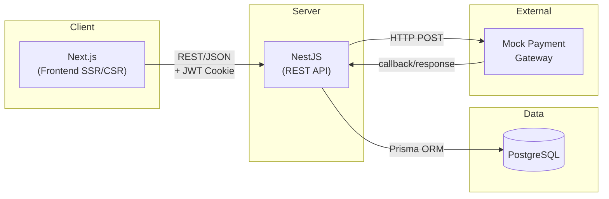
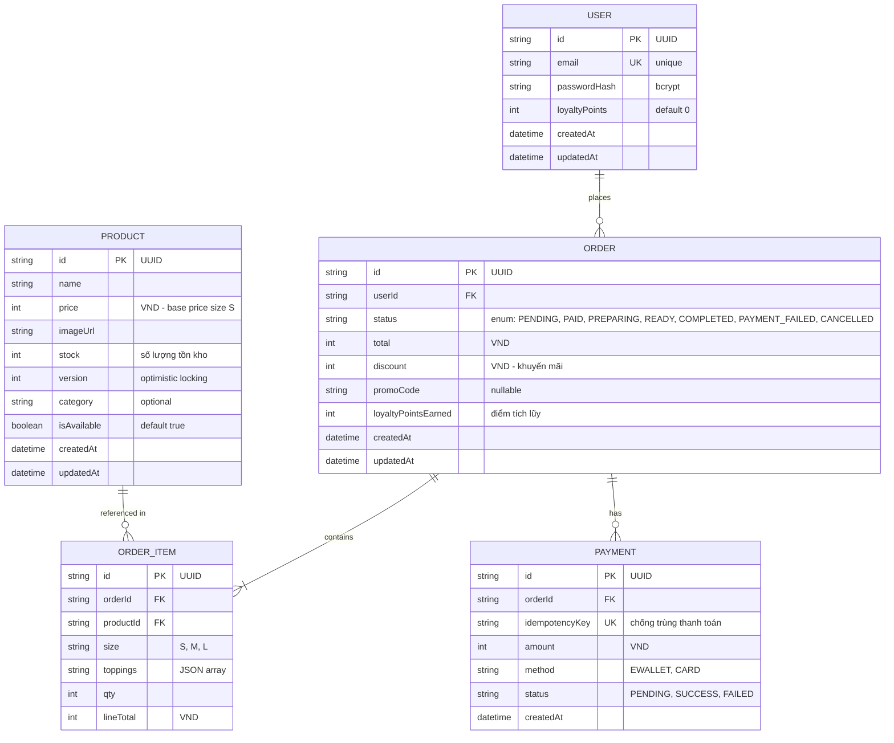
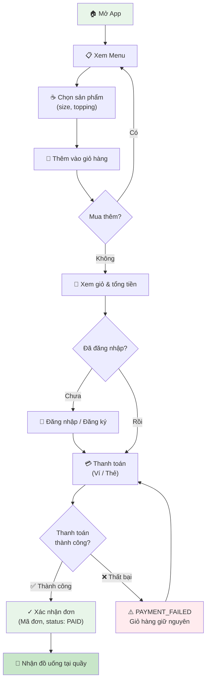
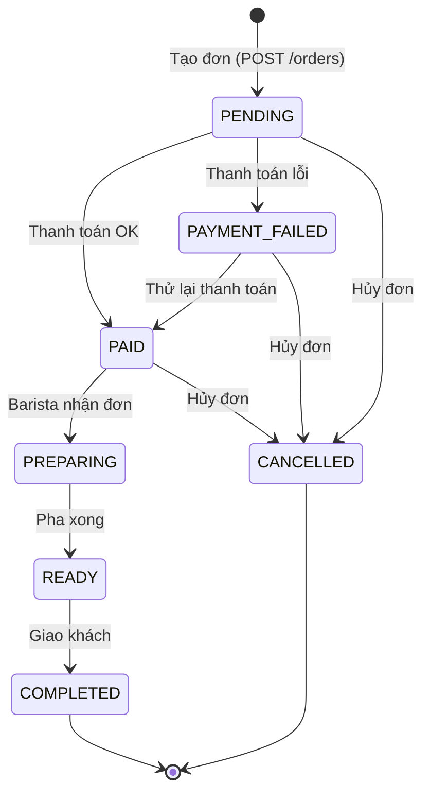
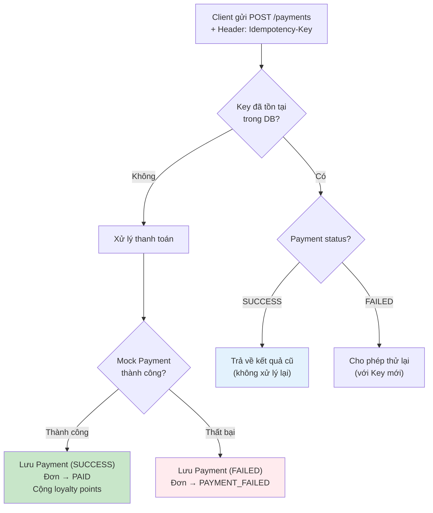
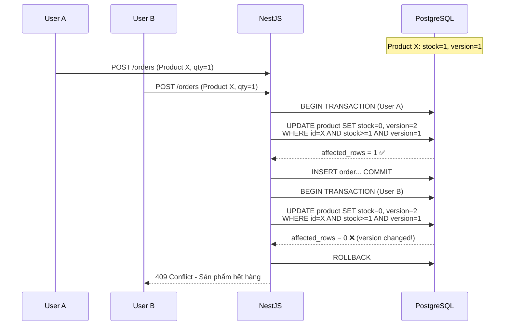

# BrewLite – Project Flow Document

> **Version:** 1.0  
> **Cập nhật:** 2026-09-21  
> **Product Vision:** *"BrewLite giúp khách hàng đặt và thanh toán đồ uống không dùng tiền mặt chỉ trong vài chạm, giảm thời gian xếp hàng và nhận đơn nhanh tại quầy."*

---

## Mục lục

1. [Tổng quan dự án](#1-tổng-quan-dự-án)
2. [Kiến trúc hệ thống](#2-kiến-trúc-hệ-thống)
3. [Database Schema (ERD)](#3-database-schema-erd)
4. [API Specification](#4-api-specification)
5. [Luồng nghiệp vụ & State Machine](#5-luồng-nghiệp-vụ--state-machine)
6. [Cấu trúc thư mục dự án](#6-cấu-trúc-thư-mục-dự-án)
7. [Sprint Planning (3 Sprints)](#7-sprint-planning-3-sprints)
8. [Non-functional Requirements & Solutions](#8-non-functional-requirements--solutions)
9. [Development Conventions](#9-development-conventions)
10. [Definition of Done](#10-definition-of-done)

---

## 1. Tổng quan dự án

### 1.1 Product Vision

BrewLite là ứng dụng đặt cà phê không dùng tiền mặt, giúp khách hàng:
- Duyệt menu → Chọn sản phẩm (size, topping) → Thêm giỏ hàng → Thanh toán online → Nhận đồ tại quầy

### 1.2 Phạm vi MVP

| Trong phạm vi | Ngoài phạm vi |
|---|---|
| Khách hàng đặt & thanh toán đơn | Dashboard admin/quản lý |
| Xem menu, chọn size/topping | Giao hàng delivery |
| Đăng ký / Đăng nhập (JWT) | Chat/hỗ trợ khách hàng |
| Lịch sử đơn hàng | Quản lý kho chi tiết |
| Mock Payment Gateway | Tích hợp cổng thanh toán thật |
| Khuyến mãi & Điểm thưởng cơ bản | CRM / Marketing automation |

### 1.3 Stakeholders

| Vai trò | Mô tả |
|---|---|
| **Khách hàng** | Đặt đồ uống, thanh toán không tiền mặt, theo dõi đơn |
| **Nhân viên/Barista** | Tiếp nhận và cập nhật trạng thái (ngoài MVP) |
| **Product Owner** | Xác định yêu cầu, ưu tiên backlog, nghiệm thu |
| **Giảng viên** | Đánh giá quy trình & sản phẩm |
| **Nhóm phát triển** | Phân tích, thiết kế, lập trình, kiểm thử |

---

## 2. Kiến trúc hệ thống

### 2.1 Architecture Overview



### 2.2 Tech Stack

| Layer | Công nghệ | Ghi chú |
|---|---|---|
| **Frontend** | Next.js 15 (App Router), TypeScript, Tailwind CSS | SSR cho SEO, CSR cho tương tác |
| **State Management** | Zustand (Cart), React Query (Server state) | Nhẹ, đơn giản, hiệu quả |
| **Backend** | NestJS (TypeScript), REST API | Modular architecture, DI |
| **Validation** | class-validator, class-transformer | DTO validation |
| **Authentication** | Passport JWT, bcrypt | HttpOnly Cookie |
| **Database** | PostgreSQL 16 + Prisma ORM | Type-safe queries |
| **Payment** | Mock Payment Service | Mô phỏng Momo/VNPay |
| **DevOps** | Docker Compose, Git | PostgreSQL container (dev) |
| **Code Quality** | ESLint, Prettier | Thống nhất code style |

### 2.3 Communication Flow

```
┌──────────────┐     HTTP/REST      ┌──────────────┐     Prisma      ┌──────────────┐
│   Next.js    │ ──────────────────► │   NestJS     │ ──────────────► │  PostgreSQL   │
│  (Port 3000) │ ◄────────────────── │  (Port 3001) │ ◄────────────── │  (Port 5432)  │
└──────────────┘     JSON + JWT     └──────────────┘     SQL Query   └──────────────┘
                     (HttpOnly                │
                      Cookie)                 │ HTTP POST
                                              ▼
                                    ┌──────────────┐
                                    │ Mock Payment │
                                    │   Gateway    │
                                    └──────────────┘
```

---

## 3. Database Schema (ERD)

### 3.1 Entity Relationship Diagram



### 3.2 Mô tả chi tiết

**Quy ước chung:**
- Tất cả `id` dùng UUID v4
- Giá tiền lưu bằng **đơn vị VND (integer)** – tránh lỗi floating point
- Timestamp tự động: `createdAt`, `updatedAt`

**Tính giá theo size:**

| Size | Hệ số nhân |
|------|-----------|
| S | x1.0 (giá gốc) |
| M | x1.2 |
| L | x1.5 |

**Topping:** Lưu dưới dạng JSON array, mỗi topping có giá cố định (VD: Trân châu +5,000đ, Kem +8,000đ).

---

## 4. API Specification

### 4.1 Base URL

```
Development: http://localhost:3001/api
```

### 4.2 Endpoints

#### 🟢 Products (Public)

| Method | Endpoint | Mô tả | Auth |
|--------|----------|--------|------|
| `GET` | `/products` | Danh sách sản phẩm (menu) | ❌ |
| `GET` | `/products/:id` | Chi tiết một sản phẩm | ❌ |

**GET /products Response:**
```json
{
  "data": [
    {
      "id": "uuid",
      "name": "Cappuccino",
      "price": 45000,
      "imageUrl": "/images/cappuccino.jpg",
      "stock": 50,
      "isAvailable": true,
      "category": "coffee"
    }
  ]
}
```

**GET /products/:id Response:**
```json
{
  "data": {
    "id": "uuid",
    "name": "Cappuccino",
    "price": 45000,
    "imageUrl": "/images/cappuccino.jpg",
    "stock": 50,
    "isAvailable": true,
    "category": "coffee",
    "sizes": [
      { "label": "S", "multiplier": 1.0 },
      { "label": "M", "multiplier": 1.2 },
      { "label": "L", "multiplier": 1.5 }
    ],
    "toppings": [
      { "name": "Trân châu", "price": 5000 },
      { "name": "Kem", "price": 8000 }
    ]
  }
}
```

#### 🔵 Authentication (Public)

| Method | Endpoint | Mô tả | Auth |
|--------|----------|--------|------|
| `POST` | `/auth/register` | Đăng ký tài khoản | ❌ |
| `POST` | `/auth/login` | Đăng nhập, set JWT cookie | ❌ |
| `POST` | `/auth/logout` | Xóa JWT cookie | ✅ |

**POST /auth/register Request:**
```json
{
  "email": "user@example.com",
  "password": "StrongP@ss1"
}
```

**POST /auth/login Response:** (Set HttpOnly Cookie)
```json
{
  "user": {
    "id": "uuid",
    "email": "user@example.com",
    "loyaltyPoints": 0
  }
}
```

#### 🟡 Orders (Protected)

| Method | Endpoint | Mô tả | Auth |
|--------|----------|--------|------|
| `POST` | `/orders` | Tạo đơn hàng (PENDING) | ✅ |
| `GET` | `/orders/me` | Lịch sử đơn của user | ✅ |
| `GET` | `/orders/:id` | Chi tiết một đơn | ✅ |

**POST /orders Request:**
```json
{
  "items": [
    {
      "productId": "uuid",
      "size": "M",
      "toppings": ["Trân châu"],
      "qty": 1
    }
  ],
  "promoCode": "WELCOME10"
}
```

**POST /orders Response:**
```json
{
  "data": {
    "id": "uuid",
    "status": "PENDING",
    "total": 59000,
    "discount": 5900,
    "items": [...],
    "createdAt": "2026-09-21T12:00:00Z"
  }
}
```

#### 🔴 Payments (Protected)

| Method | Endpoint | Mô tả | Auth |
|--------|----------|--------|------|
| `POST` | `/payments` | Thanh toán đơn (idempotent) | ✅ |

**POST /payments Request:**
```json
{
  "orderId": "uuid",
  "method": "EWALLET"
}
```

**Headers:**
```
Idempotency-Key: <uuid-v4-generated-by-client>
```

**POST /payments Response (Success):**
```json
{
  "data": {
    "id": "uuid",
    "orderId": "uuid",
    "amount": 53100,
    "method": "EWALLET",
    "status": "SUCCESS"
  },
  "order": {
    "id": "uuid",
    "status": "PAID"
  }
}
```

### 4.3 Error Response Format

```json
{
  "statusCode": 400,
  "message": "Validation failed",
  "errors": [
    {
      "field": "email",
      "message": "email must be a valid email"
    }
  ]
}
```

### 4.4 Authentication Flow

```mermaid
sequenceDiagram
    participant C as Client (Next.js)
    participant S as Server (NestJS)
    participant DB as PostgreSQL

    C->>S: POST /auth/login { email, password }
    S->>DB: Find user by email
    DB-->>S: User record
    S->>S: Verify bcrypt hash
    S->>S: Sign JWT (userId, email)
    S-->>C: Set-Cookie: jwt=<token>; HttpOnly; Path=/
    Note over C,S: Subsequent requests include cookie automatically
    C->>S: GET /orders/me (Cookie: jwt=<token>)
    S->>S: JwtAuthGuard → extract & verify token
    S->>DB: Query orders WHERE userId = token.userId
    DB-->>S: Orders list
    S-->>C: 200 OK { data: [...] }
```

---

## 5. Luồng nghiệp vụ & State Machine

### 5.1 Happy Path Flow



### 5.2 Order State Machine



### 5.3 Allowed Transitions Map

```typescript
// backend/src/modules/orders/order-state.ts
const ALLOWED_TRANSITIONS: Record<OrderStatus, OrderStatus[]> = {
  PENDING:        ['PAID', 'PAYMENT_FAILED', 'CANCELLED'],
  PAYMENT_FAILED: ['PAID', 'CANCELLED'],
  PAID:           ['PREPARING', 'CANCELLED'],
  PREPARING:      ['READY'],
  READY:          ['COMPLETED'],
  COMPLETED:      [],  // terminal state
  CANCELLED:      [],  // terminal state
};

function assertTransition(current: OrderStatus, next: OrderStatus): void {
  if (!ALLOWED_TRANSITIONS[current].includes(next)) {
    throw new BadRequestException(
      `Cannot transition from ${current} to ${next}`
    );
  }
}
```

### 5.4 Payment Idempotency Flow



### 5.5 Optimistic Locking Flow (Kiểm soát tồn kho)



---

## 6. Cấu trúc thư mục dự án

```
brewlite/
├── 📁 frontend/                      # Next.js Application
│   ├── 📁 public/                    # Static assets
│   │   └── 📁 images/               # Product images
│   ├── 📁 src/
│   │   ├── 📁 app/                   # App Router (pages)
│   │   │   ├── layout.tsx            # Root layout
│   │   │   ├── page.tsx              # Home → redirect /menu
│   │   │   ├── 📁 menu/             # Menu page
│   │   │   │   └── page.tsx
│   │   │   ├── 📁 product/
│   │   │   │   └── 📁 [id]/         # Product detail page
│   │   │   │       └── page.tsx
│   │   │   ├── 📁 cart/             # Cart page
│   │   │   │   └── page.tsx
│   │   │   ├── 📁 checkout/         # Checkout/Payment page
│   │   │   │   └── page.tsx
│   │   │   ├── 📁 order/
│   │   │   │   └── 📁 [id]/         # Order confirmation page
│   │   │   │       └── page.tsx
│   │   │   ├── 📁 orders/           # Order history page
│   │   │   │   └── page.tsx
│   │   │   └── 📁 auth/
│   │   │       ├── 📁 login/        # Login page
│   │   │       │   └── page.tsx
│   │   │       └── 📁 register/     # Register page
│   │   │           └── page.tsx
│   │   ├── 📁 components/
│   │   │   ├── 📁 ui/               # Reusable UI components
│   │   │   │   ├── Button.tsx
│   │   │   │   ├── Card.tsx
│   │   │   │   ├── Input.tsx
│   │   │   │   └── Badge.tsx
│   │   │   ├── 📁 layout/           # Layout components
│   │   │   │   ├── Header.tsx
│   │   │   │   └── Footer.tsx
│   │   │   ├── 📁 product/          # Product-specific components
│   │   │   │   ├── ProductCard.tsx
│   │   │   │   └── ProductGrid.tsx
│   │   │   └── 📁 cart/             # Cart-specific components
│   │   │       ├── CartItem.tsx
│   │   │       └── CartSummary.tsx
│   │   ├── 📁 lib/
│   │   │   ├── api.ts               # Axios instance + interceptors
│   │   │   └── utils.ts             # Helper functions
│   │   ├── 📁 stores/
│   │   │   └── cart.store.ts         # Zustand cart store
│   │   ├── 📁 hooks/
│   │   │   ├── useAuth.ts           # Auth hook
│   │   │   └── useProducts.ts       # React Query hooks
│   │   └── 📁 types/
│   │       └── index.ts             # Shared TypeScript types
│   ├── .env.example
│   ├── next.config.ts
│   ├── tailwind.config.ts
│   ├── tsconfig.json
│   └── package.json
│
├── 📁 backend/                       # NestJS Application
│   ├── 📁 prisma/
│   │   ├── schema.prisma            # Database schema
│   │   └── 📁 seed/
│   │       └── seed.ts              # Seed data (menu items)
│   ├── 📁 src/
│   │   ├── 📁 modules/
│   │   │   ├── 📁 prisma/           # PrismaModule (shared)
│   │   │   │   ├── prisma.module.ts
│   │   │   │   └── prisma.service.ts
│   │   │   ├── 📁 products/         # ProductModule
│   │   │   │   ├── products.module.ts
│   │   │   │   ├── products.controller.ts
│   │   │   │   ├── products.service.ts
│   │   │   │   └── dto/
│   │   │   ├── 📁 auth/             # AuthModule
│   │   │   │   ├── auth.module.ts
│   │   │   │   ├── auth.controller.ts
│   │   │   │   ├── auth.service.ts
│   │   │   │   ├── jwt.strategy.ts
│   │   │   │   ├── jwt-auth.guard.ts
│   │   │   │   └── dto/
│   │   │   ├── 📁 orders/           # OrderModule
│   │   │   │   ├── orders.module.ts
│   │   │   │   ├── orders.controller.ts
│   │   │   │   ├── orders.service.ts
│   │   │   │   ├── order-state.ts   # State Machine
│   │   │   │   └── dto/
│   │   │   └── 📁 payments/         # PaymentModule
│   │   │       ├── payments.module.ts
│   │   │       ├── payments.controller.ts
│   │   │       ├── payments.service.ts
│   │   │       ├── mock-payment.service.ts
│   │   │       └── dto/
│   │   ├── 📁 common/
│   │   │   ├── 📁 decorators/       # Custom decorators
│   │   │   │   └── current-user.decorator.ts
│   │   │   ├── 📁 filters/          # Exception filters
│   │   │   │   └── http-exception.filter.ts
│   │   │   └── 📁 interceptors/
│   │   │       └── transform.interceptor.ts
│   │   ├── app.module.ts
│   │   └── main.ts
│   ├── 📁 test/
│   │   ├── orders.e2e-spec.ts       # Order state machine tests
│   │   └── payments.e2e-spec.ts     # Idempotency tests
│   ├── .env.example
│   ├── nest-cli.json
│   ├── tsconfig.json
│   └── package.json
│
├── 📁 docker/
│   ├── docker-compose.dev.yml       # Dev: PostgreSQL only
│   └── docker-compose.yml           # Prod: All 3 services (Sprint 3)
│
├── PROJECT_FLOW.md                   # ← Tài liệu này
├── README.md                         # Hướng dẫn chạy dự án
├── .gitignore
└── .env.example                      # Template biến môi trường
```

---

## 7. Sprint Planning (3 Sprints)

### Sprint 1: Nền tảng & Hiển thị Menu (Task 1-4)

**Sprint Goal:** *"Khách hàng có thể xem menu và chi tiết sản phẩm trên trình duyệt"*

| Task | Story | Tiêu chí chấp nhận | Ưu tiên |
|------|-------|---------------------|---------|
| **1** | Khởi tạo dự án | Monorepo chạy được "Hello", Git, README, .env.example | P0 |
| **2** | API danh sách sản phẩm | `GET /products` trả JSON từ DB, có seed data | P0 |
| **3** | Trang Menu (Frontend) | Gọi API, render grid sản phẩm, loading/empty state | P0 |
| **4** | Chi tiết & tùy chọn | Chọn size S/M/L, topping, tính giá theo tùy chọn | P1 |

**Deliverable:** Trang menu hoạt động, hiển thị sản phẩm từ database.

---

### Sprint 2: Giỏ hàng, Đơn hàng & Auth (Task 5-7)

**Sprint Goal:** *"Khách hàng đăng nhập và đặt đơn hàng được"*

| Task | Story | Tiêu chí chấp nhận | Ưu tiên |
|------|-------|---------------------|---------|
| **5** | Giỏ hàng (Cart) | Thêm/sửa/xóa, Zustand store, tính tổng, badge count | P0 |
| **6** | API tạo đơn hàng | `POST /orders` validate & lưu PENDING, trả mã đơn | P0 |
| **7** | Đăng ký / Đăng nhập | Register, Login, bcrypt, JWT cookie, guard routes | P0 |

**Deliverable:** User flow hoàn chỉnh từ menu → giỏ → đăng nhập → tạo đơn.

---

### Sprint 3: Thanh toán, Bàn giao & Nghiệp vụ nâng cao (Task 8-10)

**Sprint Goal:** *"Hệ thống thanh toán hoạt động, đóng gói Docker, demo end-to-end"*

| Task | Story | Tiêu chí chấp nhận | Ưu tiên |
|------|-------|---------------------|---------|
| **8** | Thanh toán không tiền mặt | Mock payment, `POST /payments`, PAID/PAYMENT_FAILED | P0 |
| **9** | Xác nhận, lịch sử & bàn giao | Màn hình xác nhận, `GET /orders/me`, docker-compose full, README | P0 |
| **10** | Nghiệp vụ backend | State Machine, Idempotency, Optimistic Locking, Loyalty points | P1 |

**Deliverable:** Sản phẩm hoàn chỉnh, docker-compose chạy full, demo E2E.

---

## 8. Non-functional Requirements & Solutions

### 8.1 Hiệu năng (API < 500ms)

| Vấn đề | Giải pháp | Áp dụng |
|--------|-----------|---------|
| API GET /products chậm | Next.js ISR/SSG cache menu | Sprint 1 |
| N+1 query Prisma | Eager loading với `include` | Sprint 2 |
| Response lớn | Pagination cho /orders/me | Sprint 3 |

### 8.2 Bảo mật

| Vấn đề | Giải pháp | Áp dụng |
|--------|-----------|---------|
| Token bị đánh cắp (XSS) | JWT trong HttpOnly Cookie, SameSite=Strict | Sprint 2 |
| SQL Injection | Prisma parameterized queries (mặc định) | Sprint 1 |
| Password leak | bcrypt hash với salt rounds = 10 | Sprint 2 |
| Invalid input | class-validator trên mọi DTO | Sprint 1 |
| CORS | Whitelist `localhost:3000` cho dev | Sprint 1 |

### 8.3 Tính toàn vẹn dữ liệu

| Vấn đề | Giải pháp | Áp dụng |
|--------|-----------|---------|
| Double payment | Idempotency-Key header + unique constraint | Sprint 3 |
| Race condition tồn kho | Optimistic Locking (version field) + transaction | Sprint 3 |
| Invalid state transition | Order State Machine (assertTransition) | Sprint 3 |

### 8.4 Tương thích trình duyệt

- Target: Chrome, Firefox, Safari, Edge (latest 2 versions)
- Responsive design: Mobile-first (wireframe hiển thị dạng mobile)
- Tailwind CSS đảm bảo cross-browser compatibility

---

## 9. Development Conventions

### 9.1 Git Branching Strategy

```
main                    ← Production-ready (protected)
├── develop             ← Integration branch
│   ├── feature/task-1  ← Từng task
│   ├── feature/task-2
│   ├── feature/task-3
│   └── ...
└── hotfix/*            ← Emergency fixes
```

**Workflow:**
1. Tạo branch từ `develop`: `git checkout -b feature/task-X develop`
2. Code & commit thường xuyên
3. Push & tạo Pull Request → develop
4. Review (ít nhất 1 member) → Merge
5. Cuối Sprint: merge `develop` → `main` → Tag version

### 9.2 Commit Message Convention

Sử dụng **Conventional Commits:**

```
<type>(<scope>): <description>

feat(products): add GET /products endpoint
fix(cart): correct total calculation with toppings  
chore(docker): add PostgreSQL dev compose file
docs(readme): add setup instructions
test(orders): add state machine unit tests
refactor(auth): extract JWT strategy to separate file
```

**Types:** `feat`, `fix`, `chore`, `docs`, `test`, `refactor`, `style`

### 9.3 Code Style

**ESLint + Prettier** cấu hình chung:
- **Single quotes**, **Trailing commas**, **Semicolons**
- Max line length: 100 characters
- Indent: 2 spaces

### 9.4 Naming Conventions

| Đối tượng | Convention | Ví dụ |
|-----------|-----------|-------|
| File/Folder | kebab-case | `products.controller.ts` |
| Class | PascalCase | `ProductsService` |
| Function/Method | camelCase | `findAll()` |
| Variable | camelCase | `totalPrice` |
| Constant | UPPER_SNAKE_CASE | `JWT_SECRET` |
| Database table | snake_case | `order_items` |
| Enum | PascalCase + UPPER_SNAKE_CASE values | `OrderStatus.PENDING` |
| DTO | PascalCase + "Dto" suffix | `CreateOrderDto` |
| API route | kebab-case, plural | `/products`, `/orders` |

---

## 10. Definition of Done

Mỗi task được coi là **DONE** khi thỏa mãn:

- [ ] Code chạy được, không lỗi build
- [ ] Tuân theo tiêu chí chấp nhận (Acceptance Criteria) của task
- [ ] Commit trên Git với message rõ ràng (Conventional Commits)
- [ ] Được review bởi ít nhất 1 thành viên khác
- [ ] API có validate đầu vào (class-validator)
- [ ] UI xử lý loading/error state cơ bản
- [ ] Có hướng dẫn chạy trong README
- [ ] (Task 10) Có unit/integration test chứng minh logic

---

> **Ghi chú:** Tài liệu này là "living document" – sẽ được cập nhật qua từng Sprint khi có thay đổi yêu cầu hoặc thiết kế.
